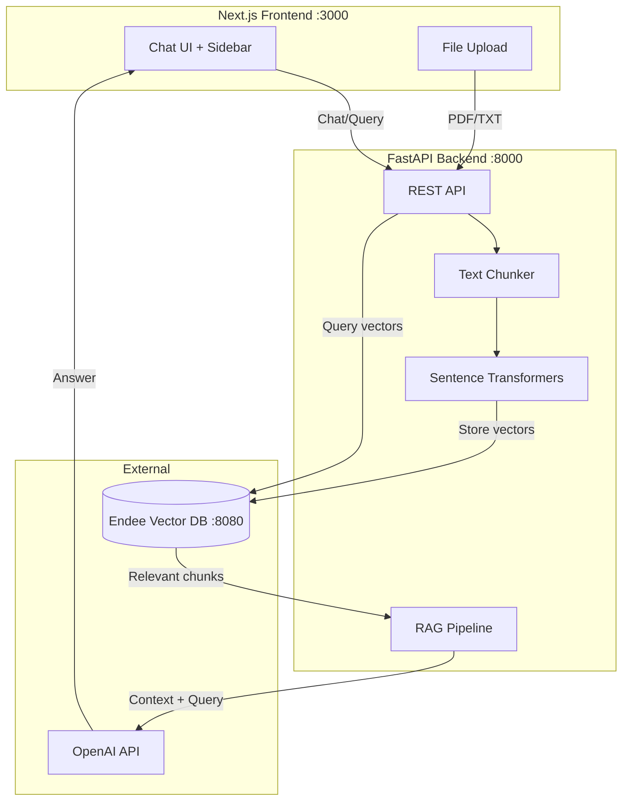

# 🧠 Endee AI Knowledge Assistant

A production-ready **Retrieval-Augmented Generation (RAG)** web application that lets users upload documents and ask questions. The system retrieves relevant context using the [Endee](https://github.com/endee-io/endee) vector database and generates accurate answers using an LLM.

---

## ✨ Features

| Feature | Description |
|---|---|
| 📄 **Document Upload** | Upload PDF/TXT files with drag-and-drop |
| 🔍 **Semantic Search** | Find relevant content using vector similarity |
| 🤖 **RAG Pipeline** | Context-aware AI answers with source citations |
| 💬 **Chat Interface** | ChatGPT-like conversational UI |
| 🌙 **Dark/Light Mode** | Toggle between themes |
| 📱 **Responsive Design** | Works on desktop and mobile |

---

## 🏗️ Architecture



### How Endee is Used

1. **Index Creation** — On startup, the backend creates a `knowledge_base` index in Endee (384-dim, cosine similarity, INT8 precision)
2. **Document Ingestion** — Uploaded documents are chunked → embedded with `all-MiniLM-L6-v2` → stored as vectors with text metadata in Endee
3. **Semantic Retrieval** — User queries are embedded → Endee performs fast nearest-neighbor search → returns top-k relevant chunks
4. **RAG Generation** — Retrieved context is sent to the LLM with the user's question to generate accurate answers

---

## 📁 Project Structure

```
endee-ai-assistant/
├── backend/                     # FastAPI Python backend
│   ├── app/
│   │   ├── main.py              # FastAPI app, middleware & router includes
│   │   ├── config.py            # Environment configuration
│   │   ├── routes/
│   │   │   ├── upload.py        # Upload & document management endpoints
│   │   │   └── query.py         # Semantic search & RAG chat endpoints
│   │   ├── services/
│   │   │   ├── embedding.py     # Sentence Transformer embeddings
│   │   │   ├── vector_store.py  # Endee vector DB wrapper
│   │   │   └── rag_pipeline.py  # RAG pipeline with OpenAI
│   │   └── utils/
│   │       └── pdf_parser.py    # PDF/TXT extraction & chunking
│   ├── requirements.txt
│   ├── Dockerfile
│   ├── .env.example
│   └── .env
├── frontend/                    # Next.js React frontend
│   ├── src/
│   │   ├── app/
│   │   │   ├── layout.tsx       # Root layout with theme
│   │   │   ├── page.tsx         # Main page
│   │   │   └── globals.css      # Theme & styling
│   │   ├── components/
│   │   │   ├── chat-panel.tsx   # Chat interface
│   │   │   ├── sidebar.tsx      # Document sidebar
│   │   │   ├── file-upload.tsx  # Upload component
│   │   │   ├── theme-toggle.tsx # Dark/light toggle
│   │   │   └── theme-provider.tsx
│   │   └── lib/
│   │       ├── api.ts           # API client
│   │       └── utils.ts         # Utilities
│   ├── package.json
│   ├── tailwind.config.js
│   └── Dockerfile
├── docker-compose.yml           # Full stack orchestration
├── .gitignore
└── README.md
```

---

## 🚀 Setup Instructions

### Prerequisites

- **Docker** (for Endee vector database)
- **Python 3.10+** (for backend)
- **Node.js 20+** (for frontend)
- **OpenAI API Key** (optional — works without it using context-only mode)

### Option 1: Docker Compose (Recommended)

Run the entire stack with one command:

```bash
# Clone the repo
git clone https://github.com/yourusername/endee-ai-assistant.git
cd endee-ai-assistant

# Set your OpenAI key (optional)
export OPENAI_API_KEY=sk-your-key-here

# Start all services
docker compose up --build
```

Access the app at **http://localhost:3000**

### Option 2: Manual Setup

#### 1. Start Endee Vector Database

```bash
docker run \
  --ulimit nofile=100000:100000 \
  -p 8080:8080 \
  -v ./endee-data:/data \
  --name endee-server \
  endeeio/endee-server:latest
```

#### 2. Start the Backend

```bash
cd backend

# Create virtual environment
python -m venv venv
source venv/bin/activate  # or venv\Scripts\activate on Windows

# Install dependencies
pip install -r requirements.txt

# Configure environment
cp .env.example .env
# Edit .env and add your OPENAI_API_KEY (optional)

# Run the server
uvicorn app.main:app --reload --port 8000
```

#### 3. Start the Frontend

```bash
cd frontend

# Install dependencies
npm install

# Run dev server
npm run dev
```

Open **http://localhost:3000** in your browser.

---

## 🔌 API Endpoints

| Method | Endpoint | Description |
|---|---|---|
| `GET` | `/api/health` | Health check |
| `POST` | `/api/upload` | Upload document (multipart form) |
| `POST` | `/api/query` | Semantic search |
| `POST` | `/api/chat` | RAG chat pipeline |
| `GET` | `/api/documents` | List all documents |
| `DELETE` | `/api/documents/{id}` | Delete a document |

---

## 🛠️ Tech Stack

| Layer | Technology |
|---|---|
| **Frontend** | Next.js 15, React 19, Tailwind CSS |
| **Backend** | FastAPI, Python 3.10+, Uvicorn |
| **Embeddings** | Sentence Transformers (`all-MiniLM-L6-v2`, 384-dim) via HF Inference API |
| **Vector DB** | [Endee](https://github.com/endee-io/endee) |
| **LLM** | OpenAI API (GPT-3.5/4) |
| **Infra** | Docker, Docker Compose |

---

## 🔮 Future Improvements

- [ ] Authentication & user accounts
- [ ] Chat history persistence (database)
- [ ] Streaming LLM responses (SSE)
- [ ] Support for more file formats (DOCX, MD, CSV)
- [ ] Hybrid search (dense + sparse vectors)
- [ ] Multi-document chat with filtering
- [ ] Export conversations
- [ ] Admin dashboard with usage analytics

---

## 📄 License

This project is open source. The Endee vector database is licensed under [Apache License 2.0](https://github.com/endee-io/endee/blob/master/LICENSE).
